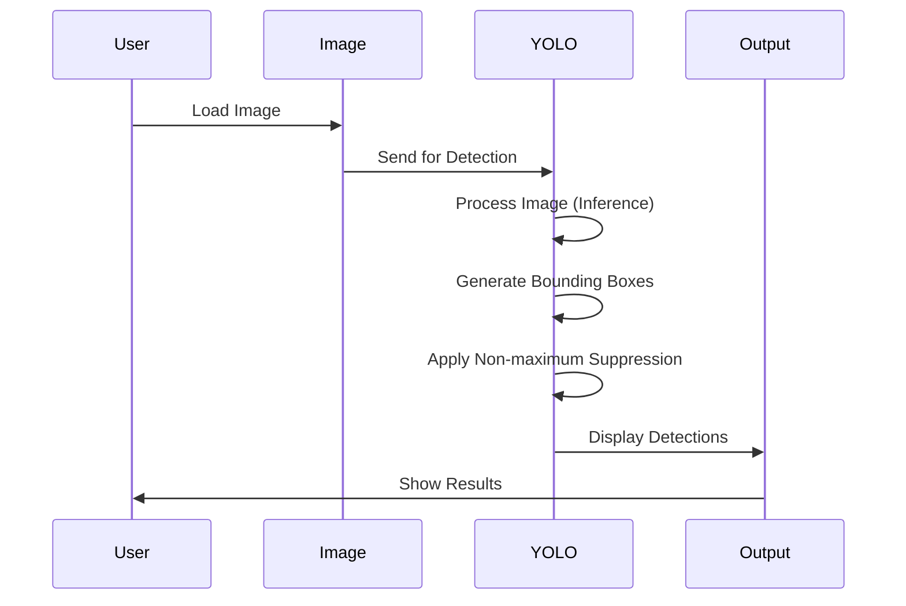
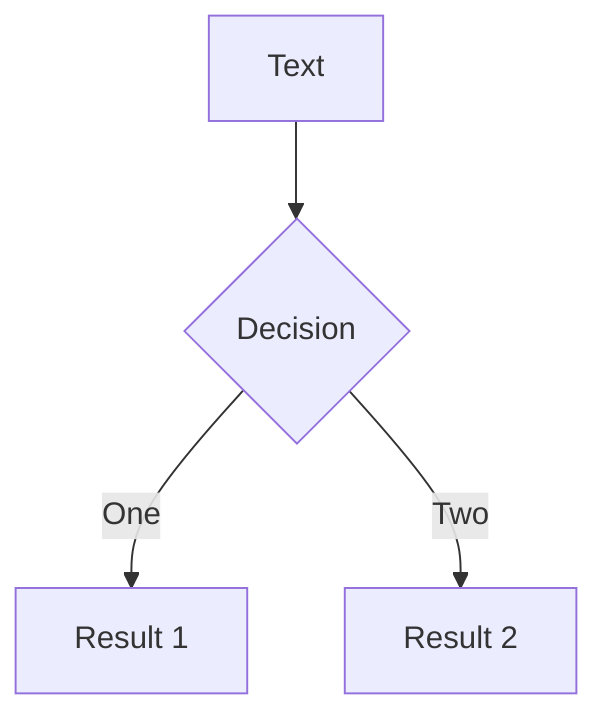
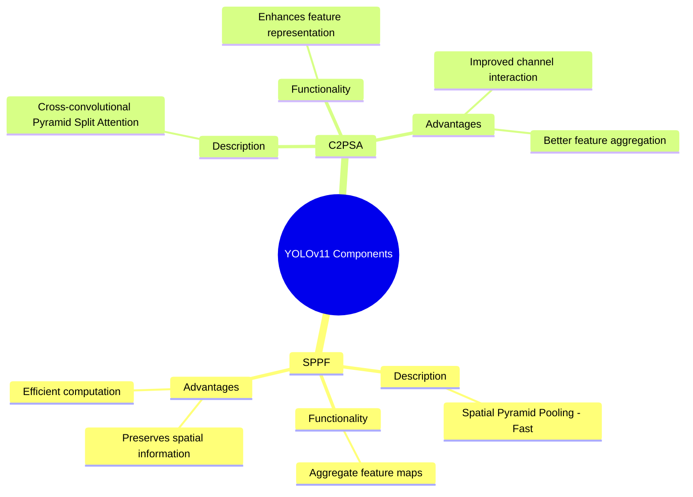
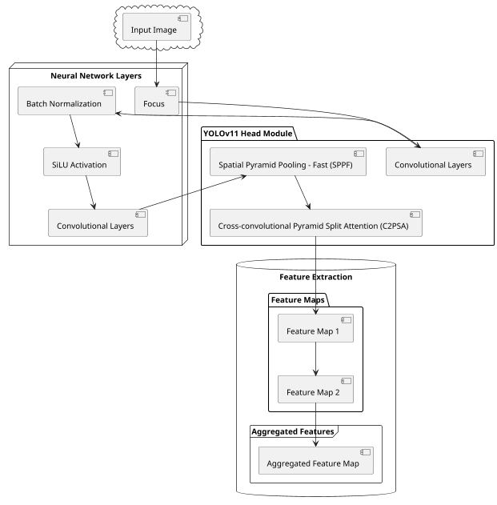

---
# You can also start simply with 'default'
theme: seriph
# random image from a curated Unsplash collection by Anthony
# like them? see https://unsplash.com/collections/94734566/slidev
background: https://cover.sli.dev
# some information about your slides (markdown enabled)
title: Welcome to Slidev
info: |
  ## Slidev Starter Template
  Presentation slides for developers.

  Learn more at [Sli.dev](https://sli.dev)
# apply unocss classes to the current slide
class: text-center
# https://sli.dev/features/drawing
drawings:
  persist: false
# slide transition: https://sli.dev/guide/animations.html#slide-transitions
transition: slide-left
# enable MDC Syntax: https://sli.dev/features/mdc
mdc: true
---

# YOLOv11: An Overview of the Key Architectural Enhancements

**Rahima Khanam\* and Muhammad Hussain**

**presenter qian zhex uan**

<div class="pt-12">
  <span @click="$slidev.nav.next" class="px-2 py-1 rounded cursor-pointer" hover="bg-white bg-opacity-10">
    Press Space for next page <carbon:arrow-right class="inline"/>
  </span>
</div>

<div class="abs-br m-6 flex gap-2">
  <button @click="$slidev.nav.openInEditor()" title="Open in Editor" class="text-xl slidev-icon-btn opacity-50 !border-none !hover:text-white">
    <carbon:edit />
  </button>
  <a href="https://github.com/slidevjs/slidev" target="_blank" alt="GitHub" title="Open in GitHub"
    class="text-xl slidev-icon-btn opacity-50 !border-none !hover:text-white">
    <carbon-logo-github />
  </a>
</div>

<!--
The last comment block of each slide will be treated as slide notes. It will be visible and editable in Presenter Mode along with the slide. [Read more in the docs](https://sli.dev/guide/syntax.html#notes)
-->

---

## abstraction

<div style="display: flex;">

<!-- Left Column: Full Abstract Quote -->
<div style="flex: 50%; padding: 10px;">

## Full Abstract Quote

<div style="flex: 50%; padding: 1px; font-size: 15px;">

<p><span style="color: blue;">The rapid advancement in object detection has been fueled by the development of deep learning techniques, particularly convolutional neural networks (CNNs). In this paper, we propose a novel method for object detection that builds upon the strengths of CNNs by introducing an adaptive feature extraction module.</span> <span style="color: green;">The key innovation of our approach is the multi-scale feature fusion network, which effectively merges features from different layers of the CNN, enabling the model to detect objects of varying sizes and from different viewpoints.</span> <span style="color: red;">Our method involves training the network with a combination of synthetic and real-world images to enhance its robustness and generalizability.</span> <span style="color: purple;">Experimental results on the COCO and Pascal VOC datasets show that our method outperforms state-of-the-art object detection models by a significant margin.</span> <span style="color: orange;">The proposed method paves the way for further research in object detection and can be extended to other computer vision tasks such as segmentation and tracking.</span></p>

</div>

</div>

<!-- Right Column: Categorized Excerpts with Color Coding -->
<div style="flex: 50%; padding: 1px;font-size: 15px;">

### Categorized Excerpts with Color Coding

- **Introduction of the Method (Blue):**
  "Proposing a new object detection method leveraging adaptive feature extraction in CNNs."
- **Innovation Points (Green):**
  "Innovative multi-scale feature fusion network enhances detection across various sizes and viewpoints."

- **Methodology (Red):**
  "Methodology combines synthetic and real-world images for robust and generalizable training."
- **Results and Discussion (Purple):**
  "Significant performance improvement over state-of-the-art models on COCO and Pascal VOC datasets."

- **Conclusion and Future Work (Orange):**
  "Potential for further research in object detection and application to segmentation and tracking."

</div>

</div>

---

# Introduction

- **Background**: The rapid advancements in the field of computer vision have led to significant progress in object detection, a crucial aspect of this domain.
- **YOLO Series**: The YOLO (You Only Look Once) series of models, known for their single-stage detection and real-time performance, have been at the forefront of this progress.
- **YOLOv11**: As the latest iteration of the YOLO series, YOLOv11 represents a major leap forward in real-time object detection technology, introducing substantial improvements in architecture and training methodologies.
- **Innovations**: YOLOv11 incorporates several novel architectural elements, including the C3k2 module, SPPF, and C2PSA, which enhance feature extraction and contribute to higher accuracy.
- **Multi-Task Capabilities**: YOLOv11 goes beyond object detection, supporting various computer vision tasks like instance segmentation, pose estimation, and image classification, making it a versatile tool.
- **Performance**: YOLOv11 demonstrates superior performance compared to its predecessors, achieving higher accuracy with faster processing speeds and reduced parameter counts.

<style>
h1 {
  background-color: #2B90B6;
  background-image: linear-gradient(45deg, #4EC5D4 10%, #146b8c 20%);
  background-size: 100%;
  -webkit-background-clip: text;
  -moz-background-clip: text;
  -webkit-text-fill-color: transparent;
  -moz-text-fill-color: transparent;
}
</style>

---

## transition: fade-out

# What is Slidev?

Slidev is a slides maker and presenter designed for developers, consist of the following features

- 📝 **Text-based** - focus on the content with Markdown, and then style them later
- 🎨 **Themable** - themes can be shared and re-used as npm packages
- 🧑‍💻 **Developer Friendly** - code highlighting, live coding with autocompletion
- 🤹 **Interactive** - embed Vue components to enhance your expressions
- 🎥 **Recording** - built-in recording and camera view
- 📤 **Portable** - export to PDF, PPTX, PNGs, or even a hostable SPA
- 🛠 **Hackable** - virtually anything that's possible on a webpage is possible in Slidev
  <br>
  <br>

Read more about [Why Slidev?](https://sli.dev/guide/why)

<!--
You can have `style` tag in markdown to override the style for the current page.
Learn more: https://sli.dev/features/slide-scope-style
-->

<style>
h1 {
  background-color: #2B90B6;
  background-image: linear-gradient(45deg, #4EC5D4 10%, #146b8c 20%);
  background-size: 100%;
  -webkit-background-clip: text;
  -moz-background-clip: text;
  -webkit-text-fill-color: transparent;
  -moz-text-fill-color: transparent;
}
</style>

<!--
Here is another comment.
-->

---

# Evolution of YOLO models

- Table 1: Overview of YOLO model evolution
- Key contributions and framework changes of each iteration
- > "The introduction of C3k2, SPPF, and C2PSA modules in YOLOv11 marks a significant leap forward in the model's ability to extract features, which is pivotal for a range of computer vision tasks." ([arXiv](https://arxiv.org/abs/...))

| Version | Release Year | Tasks                                                                               | Key Contributions                                 | Framework |
| ------- | ------------ | ----------------------------------------------------------------------------------- | ------------------------------------------------- | --------- |
| YOLO    | 2015         | Object Detection, Basic Classification                                              | Single-stage object detector                      | Darknet   |
| YOLOv2  | 2016         | Object Detection, Improved Classification                                           | Multi-scale training, dimension clustering        | Darknet   |
| YOLOv3  | 2018         | Object Detection, Multi-scale Detection                                             | SPP block, Darknet-53 backbone                    | Darknet   |
| YOLOv4  | 2020         | Object Detection, Basic Object Tracking                                             | Mish activation, CSPDarknet-53 backbone           | Darknet   |
| YOLOv5  | 2020         | Object Detection, Basic Instance Segmentation (via custom modifications)            | Anchor-free detection, SWISH activation, PANet    | PyTorch   |
| YOLOv6  | 2022         | Object Detection, Instance Segmentation                                             | Self-attention, anchor-free OD                    | PyTorch   |
| YOLOv7  | 2022         | Object Detection, Object Tracking, Instance Segmentation                            | Transformers, E-ELAN reparameterisation           | PyTorch   |
| YOLOv8  | 2023         | Object Detection, Instance Segmentation, Panoptic Segmentation, Keypoint Estimation | GANs, anchor-free detection                       | PyTorch   |
| YOLOv9  | 2024         | Object Detection, Instance Segmentation                                             | PGI and GELAN                                     | PyTorch   |
| YOLOv10 | 2024         | Object Detection                                                                    | Consistent dual assignments for NMS-free training | PyTorch   |

<!-- https://sli.dev/guide/animations.html#click-animation -->

---

layout: two-cols
layoutClass: gap-16

---

# Table of contents

You can use the `Toc` component to generate a table of contents for your slides:

```html
<Toc minDepth="1" maxDepth="1"></Toc>
```

The title will be inferred from your slide content, or you can override it with `title` and `level` in your frontmatter.

::right::

<Toc v-click minDepth="1" maxDepth="2"></Toc>

---

## Introduction

- **Background**: The rapid advancements in the field of computer vision have led to significant progress in object detection, a crucial aspect of this domain.
- **YOLO Series**: The YOLO (You Only Look Once) series of models, known for their single-stage detection and real-time performance, have been at the forefront of this progress.
- **YOLOv11**: As the latest iteration of the YOLO series, YOLOv11 represents a major leap forward in real-time object detection technology, introducing substantial improvements in architecture and training methodologies.
- **Innovations**: YOLOv11 incorporates several novel architectural elements, including the C3k2 module, SPPF, and C2PSA, which enhance feature extraction and contribute to higher accuracy.
- **Multi-Task Capabilities**: YOLOv11 goes beyond object detection, supporting various computer vision tasks like instance segmentation, pose estimation, and image classification, making it a versatile tool.
- **Performance**: YOLOv11 demonstrates superior performance compared to its predecessors, achieving higher accuracy with faster processing speeds and reduced parameter counts.
  layout: image-right
  image: https://cover.sli.dev

---

# Code

Use code snippets and get the highlighting directly, and even types hover!

```ts {all|5|7|7-8|10|all} twoslash
// TwoSlash enables TypeScript hover informat
// and errors in markdown code blocks
// More at https://shiki.style/packages/twoslash

import { computed, ref } from 'vue'

const count = ref(0)
const doubled = computed(() => count.value * 2)

doubled.value = 2
```

<arrow v-click="[4, 5]" x1="350" y1="310" x2="195" y2="334" color="#953" width="2" arrowSize="1" />

<!-- This allow you to embed external code blocks -->

<<< @/snippets/external.ts#snippet

<!-- Footer -->

[Learn more](https://sli.dev/features/line-highlighting)

<!-- Inline style -->
<style>
.footnotes-sep {
  @apply mt-5 opacity-10;
}
.footnotes {
  @apply text-sm opacity-75;
}
.footnote-backref {
  display: none;
}
</style>

<!--
Notes can also sync with clicks

[click] This will be highlighted after the first click

[click] Highlighted with `count = ref(0)`

[click:3] Last click (skip two clicks)
-->

---

## level: 2

# Shiki Magic Move

Powered by [shiki-magic-move](https://shiki-magic-move.netlify.app/), Slidev supports animations across multiple code snippets.

Add multiple code blocks and wrap them with <code>````md magic-move</code> (four backticks) to enable the magic move. For example:

````md magic-move {lines: true}
```ts {*|2|*}
// step 1
const author = reactive({
  name: 'John Doe',
  books: [
    'Vue 2 - Advanced Guide',
    'Vue 3 - Basic Guide',
    'Vue 4 - The Mystery'
  ]
})
```

```ts {*|1-2|3-4|3-4,8}
// step 2
export default {
  data() {
    return {
      author: {
        name: 'John Doe',
        books: [
          'Vue 2 - Advanced Guide',
          'Vue 3 - Basic Guide',
          'Vue 4 - The Mystery'
        ]
      }
    }
  }
}
```

```ts
// step 3
export default {
  data: () => ({
    author: {
      name: 'John Doe',
      books: [
        'Vue 2 - Advanced Guide',
        'Vue 3 - Basic Guide',
        'Vue 4 - The Mystery'
      ]
    }
  })
}
```

Non-code blocks are ignored.

```vue
<!-- step 4 -->
<script setup>
const author = {
  name: 'John Doe',
  books: [
    'Vue 2 - Advanced Guide',
    'Vue 3 - Basic Guide',
    'Vue 4 - The Mystery'
  ]
}
</script>
```
````

---

# Components

<div grid="~ cols-2 gap-4">
<div>

You can use Vue components directly inside your slides.

We have provided a few built-in components like `<Tweet/>` and `<Youtube/>` that you can use directly. And adding your custom components is also super easy.

```html
<Counter :count="10" />
```

<!-- ./components/Counter.vue -->
<Counter :count="10" m="t-4" />

Check out [the guides](https://sli.dev/builtin/components.html) for more.

</div>
<div>

```html
<Tweet id="1390115482657726468" />
```

<Tweet id="1390115482657726468" scale="0.65" />

</div>
</div>

<!--
Presenter note with **bold**, *italic*, and ~~striked~~ text.

Also, HTML elements are valid:
<div class="flex w-full">
  <span style="flex-grow: 1;">Left content</span>
  <span>Right content</span>
</div>
-->

---

# Themes

Slidev comes with powerful theming support. Themes can provide styles, layouts, components, or even configurations for tools. Switching between themes by just **one edit** in your frontmatter:

<div grid="~ cols-2 gap-2" m="t-2">

```yaml
---
theme: default
---
```

```yaml
---
theme: seriph
---
```


</div>

Read more about [How to use a theme](https://sli.dev/guide/theme-addon#use-theme) and
check out the [Awesome Themes Gallery](https://sli.dev/resources/theme-gallery).

---

# discusison

You can add `v-click` to elements to add a click animation.

<div v-click>

YOLO11 marks a significant leap forward in object detection technology, building upon its predecessors while
introducing innovative enhancements. This latest iteration demonstrates remarkable versatility and efficiency across
various CV tasks.

```html
<div v-click>This shows up when you click the slide.</div>
```

</div>

<br>

<div v-click>
    YOLOv11 represents a significant advancement in the field of CV, offering a compelling combination of 
    <span v-mark.underline.red="1">enhanced performance</span> and 
    <span v-mark.underline.blue="2">versatility</span>.
</div>

<div v-click>
    This latest iteration of the YOLO architecture demonstrates 
    <span v-mark.circle.green="3">marked improvements</span> in 
    <span v-mark.underline.purple="4">accuracy and processing speed</span>,
</div>

<div v-click>
    while simultaneously reducing the number of parameters required. Such optimizations make YOLOv11 particularly well-suited for a wide range of applications,
</div>

<div v-click>
    from <span v-mark.brush.pink="5">edge computing</span> to 
    <span v-mark.squiggle.yellow="6">cloud-based analysis</span>.
</div>

<div mt-20 v-click>

[Learn more](https://sli.dev/guide/animations#click-animation)

</div>

---

# Motions

Motion animations are powered by [@vueuse/motion](https://motion.vueuse.org/), triggered by `v-motion` directive.

```html
<div
  v-motion
  :initial="{ x: -80 }"
  :enter="{ x: 0 }"
  :click-3="{ x: 80 }"
  :leave="{ x: 1000 }"
>
  Slidev
</div>
```

<div class="w-60 relative">
  <div class="relative w-40 h-40">
    
    
    
  </div>

  <div
    class="text-5xl absolute top-14 left-40 text-[#2B90B6] -z-1"
    v-motion
    :initial="{ x: -80, opacity: 0}"
    :enter="{ x: 0, opacity: 1, transition: { delay: 2000, duration: 1000 } }">
    Slidev
  </div>
</div>

<!-- vue script setup scripts can be directly used in markdown, and will only affects current page -->
<script setup lang="ts">
const final = {
  x: 0,
  y: 0,
  rotate: 0,
  scale: 1,
  transition: {
    type: 'spring',
    damping: 10,
    stiffness: 20,
    mass: 2
  }
}
</script>

<div
  v-motion
  :initial="{ x:35, y: 30, opacity: 0}"
  :enter="{ y: 0, opacity: 1, transition: { delay: 3500 } }">

[Learn more](https://sli.dev/guide/animations.html#motion)

</div>

---

# LaTeX

"I have tried to avoid mathematical equations whenever possible, but on occasion I have had to include them. I apologize for this, but it is sometimes necessary to use equations to explain the argument clearly." — Stephen Hawking, A Brief History of Time.

Inline

$$

\text{Pr}(Class*i | Object) \times \text{IOU}(b, b_i) \times p*{obj} \\


$$

Block

$$

{1|3|all}
\begin{aligned}
b &= \sigma(t_x) + c_x \\
t_y &= \sigma(t_y) + c_y \\
t_w &= p_w e^{t_w} \\
t_h &= p_h e^{t_h} \\{\partial t}
\end{aligned}


$$

[Learn more](https://sli.dev/features/latex)

---

# Diagrams

You can create diagrams / graphs from textual descriptions, directly in your Markdown.

<div class="grid grid-cols-4 gap-5 pt-4 -mb-6">









</div>

Learn more: [Mermaid Diagrams](https://sli.dev/features/mermaid) and [PlantUML Diagrams](https://sli.dev/features/plantuml)

---
